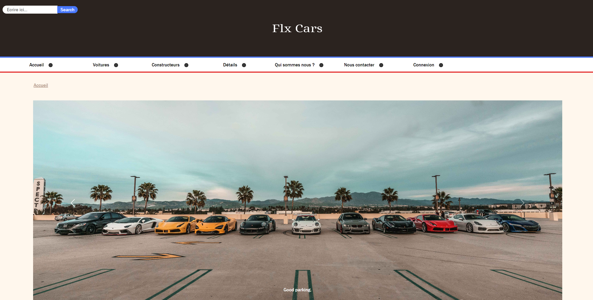
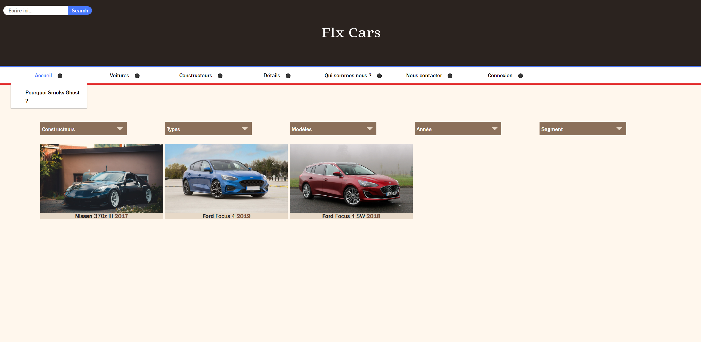
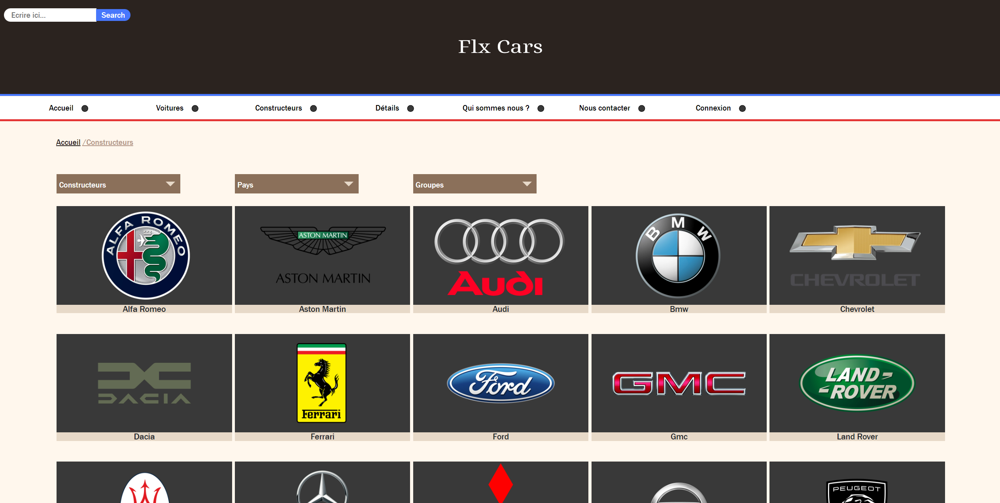
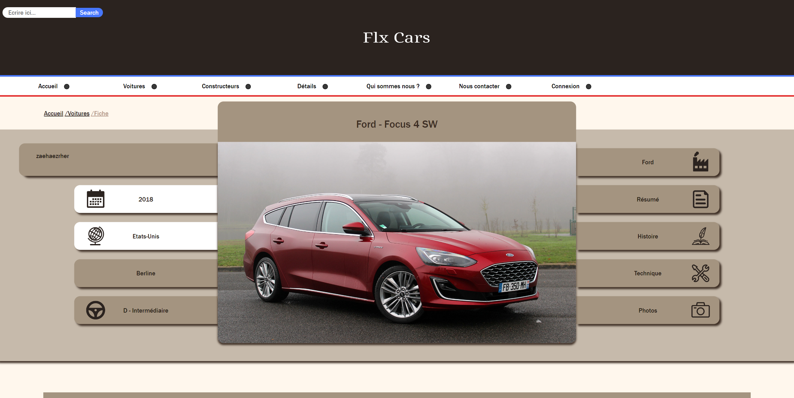

# Flxcars
*Website based on history of cars. (In french)*

## Goal
In this project, my objective was to enhance my web programming skills by utilizing various tools such as PHP, JavaScript, and MySQL for the database.

## Preview

1. Index of the website

2. Cars page ( where u can find your dream car)

3. Constructors

4. Details of your dream car

## How to install the project

Firstly, you will need an web development environment like [WampServer](https://www.wampserver.com/) or [Xamp](https://www.apachefriends.org/fr/index.html).

After that, you will need to setup the database. The config file is in **/cars/infos/flxcars.sql**.
Make sure to import this file in your database and it would be fine.

Final task : In the file **"database.php"** which is in **/cars/code/actions/database.php**, you need to change the username and password on the third line.

That's it ! Enjoy the project ! :)

## Structure

This website is primarily coded in PHP, with some JavaScript scripts, notably for the selection boxes of car models.

## Database
The database structure :

| annees | constructeurs |     fiches      | groupes | imagesFiche |     modeles     | motorisationsessence  |  motorisationsgasoil  | pays | segments | types |  users   |
|--------|:-------------:|:---------------:|:-------:|:-----------:|:---------------:|:---------------------:|:---------------------:|:----:|:--------:|:-----:|:--------:|
| id     |      id       |       id        |   id    |     id      |       id        | **feature not added** | **feature not added** |  id  |    id    |  id   |    id    |
| nom    |      nom      | id_constructeur |   nom   |    img_1    |       nom       |                       |                       | nom  |   nom    |  nom  |  pseudo  |
|        |     image     |     id_type     |         |    img_2    | id_constructeur |                       |                       |      |  image   | image |  prenom  |
|        |    id_pays    |    id_modele    |         |    img_3    |                 |                       |                       |      |          |       |   nom    |
|        |   id_groupe   |    id_annee     |         |    img_4    |                 |                       |                       |      |          |       |   mail   |
|        |               |   id_segment    |         |    img_5    |                 |                       |                       |      |          |       | password |
|        |               |       nom       |         |  id_fiche   |                 |                       |                       |      |          |       |          |
|        |               |     resume      |         |  id_modele  |                 |                       |                       |      |          |       |          |
|        |               |   description   |         |             |                 |                       |                       |      |          |       |          |
|        |               |  motorisation   |         |             |                 |                       |                       |      |          |       |          |
|        |               |      date       |         |             |                 |                       |                       |      |          |       |          |
|        |               |     id_user     |         |             |                 |                       |                       |      |          |       |          |
|        |               |      image      |         |             |                 |                       |                       |      |          |       |          |
